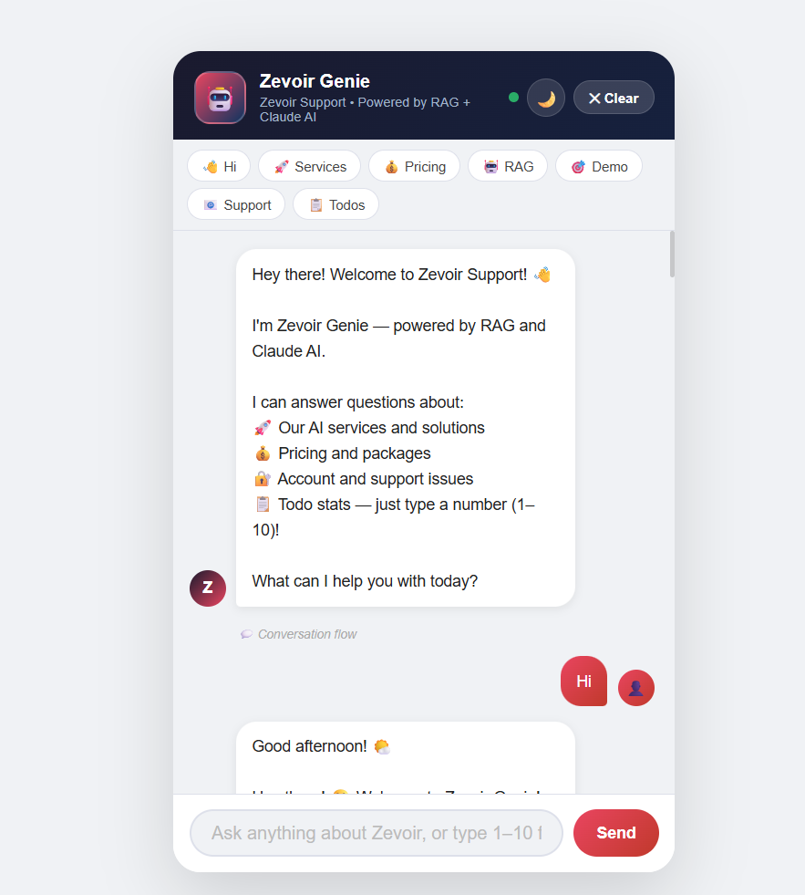

# Zevoir Genie — RAG-Powered AI Chatbot

A full-stack AI chatbot built for Zevoir Technologies that answers questions from custom business documents using a RAG (Retrieval-Augmented Generation) pipeline and Claude AI.



---

## What It Does

- **RAG Pipeline** — chunks business documents, generates embeddings using sentence-transformers, retrieves top-k relevant chunks via cosine similarity search
- **Claude API Integration** — grounded answers generated strictly from retrieved document context, preventing hallucination through prompt engineering
- **Flask REST API** — 5 endpoints (`/chat`, `/lead`, `/rate`, `/leads`, `/`) handling JSON request/response between HTML frontend and Python backend
- **Conversation Memory** — maintains context across messages within a session
- **Lead Scoring** — automatically classifies users as hot/warm/cold based on intent keywords
- **Fuzzy Matching** — handles spelling variations and short-form expansions (e.g. "u" → "you")
- **Todo Integration** — fetches live data from JSONPlaceholder API when user types a number (1–10)

---

## Tech Stack

| Layer | Technology |
|-------|-----------|
| Backend | Python, Flask |
| AI / LLM | Anthropic Claude API (`claude-opus-4-5`) |
| Embeddings | sentence-transformers (`all-MiniLM-L6-v2`) |
| Similarity Search | NumPy cosine similarity |
| Frontend | HTML, CSS, JavaScript |
| Testing | pytest, unittest.mock |
| CI/CD | GitHub Actions |

---

## Project Structure

```
zevoir_rag/
├── app.py                  ← Flask server and all route logic
├── rag.py                  ← RAG pipeline (chunk, embed, retrieve)
├── async_demo.py           ← asyncio demo — async vs sync comparison
├── context_manager_demo.py ← Context manager demo for document loading
├── requirements.txt
├── .env                    ← API key (never committed)
├── .gitignore
├── documents/
│   ├── services.txt
│   ├── pricing.txt
│   ├── faq.txt
│   ├── support.txt
│   └── about.txt
├── templates/
│   └── index.html
└── tests/
    ├── test_rag.py         ← 12 unit tests for RAG functions
    └── test_app.py         ← Tests for Flask endpoints
```

---

## How RAG Works Here

```
User question
     ↓
Convert question to embedding vector (sentence-transformers)
     ↓
Compare against all document chunk vectors (cosine similarity)
     ↓
Retrieve top-3 most relevant chunks
     ↓
Pass chunks + question to Claude API as context
     ↓
Claude generates grounded answer from documents only
     ↓
Return answer with source citation
```

---

## Setup and Run

### 1. Clone the repo
```bash
git clone https://github.com/Sathvika2711/Zevoir-rag-chatbot.git
cd Zevoir-rag-chatbot
```

### 2. Install dependencies
```bash
pip install -r requirements.txt
```

### 3. Add your API key
Create a `.env` file in the root:
```
ANTHROPIC_API_KEY=sk-ant-your-key-here
```

### 4. Run the server

**Windows (PowerShell):**
```bash
$env:ANTHROPIC_API_KEY="sk-ant-your-key-here"
python app.py
```

**Mac/Linux:**
```bash
export ANTHROPIC_API_KEY="sk-ant-your-key-here"
python app.py
```

### 5. Open in browser
```
http://localhost:5000
```

---

## Running Tests

```bash
python -m pytest tests/test_rag.py -v
```

12 unit tests covering:
- `split_into_chunks()` — chunk size, overlap, edge cases
- `cosine_similarity()` — identical, orthogonal, zero vectors

Tests use `unittest.mock` to mock the sentence-transformers model so no download is needed to run the test suite.

---

## CI/CD

GitHub Actions runs the test suite automatically on every push.

See `.github/workflows/tests.yml`

---

## Interview Notes

> *"I built a RAG-powered chatbot for Zevoir Technologies using Flask as the REST API backend and Claude as the LLM. The system chunks business documents, converts them to embeddings using sentence-transformers, and retrieves the most relevant chunks using cosine similarity before passing them to Claude as context. This prevents hallucination because Claude is constrained to answer only from verified documents. I chose Flask over FastAPI because this was a prototype — FastAPI would be the upgrade path for production scale."*

---

## Author

**Sathvika Mannepally**  
Bachelor of Information Technology (AI & Cybersecurity) — Macquarie University  
GitHub: [@Sathvika2711](https://github.com/Sathvika2711)
